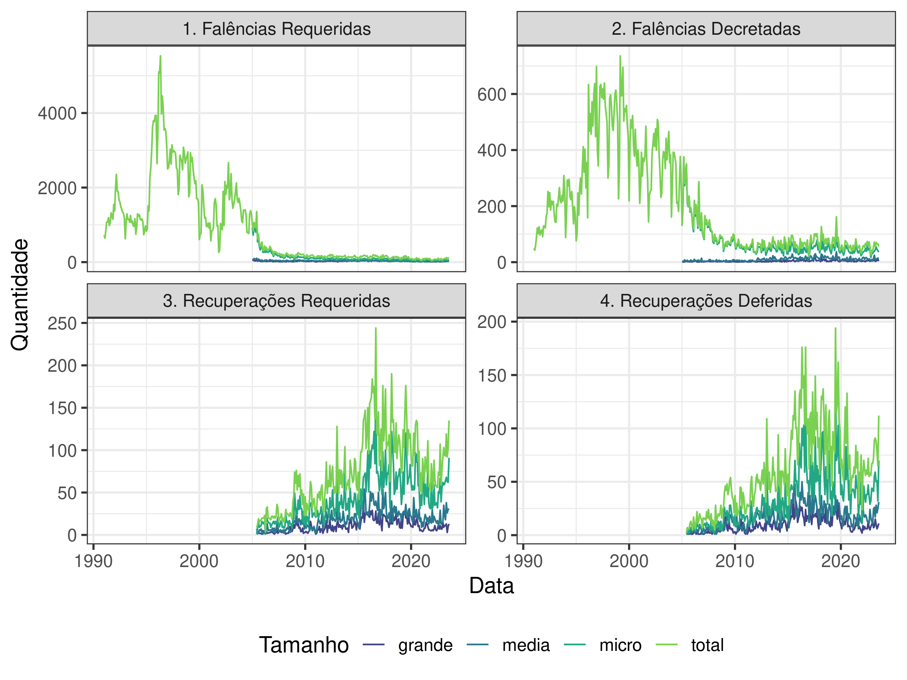

<!-- README.md is generated from README.Rmd. Please edit that file -->

# falrec 

<!-- badges: start -->

[](https://github.com/abjur/falrec/actions)
<!-- badges: end -->

O pacote `{falrec}` baixa e atualiza os dados de falências e
recuperações disponibilizados pelo [Serasa
Experian](https://www.serasaexperian.com.br/amplie-seus-conhecimentos/indicadores-economicos).

## Base de dados

A base de dados pode ser acessada diretamente dos releases rodando a
função `falrec_data()`

``` r
library(falrec)

falrec <- falrec_data()

tail(falrec, 20)
#> # A tibble: 20 × 5
#>    data       tipo  evento tamanho     n
#>    <date>     <chr> <chr>  <chr>   <dbl>
#>  1 2022-10-01 rec   def    micro      29
#>  2 2022-10-01 rec   def    media      24
#>  3 2022-10-01 rec   def    grande      5
#>  4 2022-10-01 rec   def    total      58
#>  5 2022-11-01 fal   req    micro      44
#>  6 2022-11-01 fal   req    media      33
#>  7 2022-11-01 fal   req    grande     18
#>  8 2022-11-01 fal   req    total      95
#>  9 2022-11-01 fal   dec    micro      17
#> 10 2022-11-01 fal   dec    media       5
#> 11 2022-11-01 fal   dec    grande      4
#> 12 2022-11-01 fal   dec    total      26
#> 13 2022-11-01 rec   req    micro      39
#> 14 2022-11-01 rec   req    media      13
#> 15 2022-11-01 rec   req    grande      7
#> 16 2022-11-01 rec   req    total      59
#> 17 2022-11-01 rec   def    micro      32
#> 18 2022-11-01 rec   def    media      16
#> 19 2022-11-01 rec   def    grande      8
#> 20 2022-11-01 rec   def    total      56
```

Também é possível baixar a base diretamente do site através da função
`load_falrec()`. A princípio, essa função não é necessária, pois a base
é atualizada mensalmente.

Se quiser acessar a base em excel, ela pode ser obtida [neste
link](https://github.com/abjur/falrec/releases/download/v0.2.0/falrec.xlsx).

## Gráfico

Exemplo de gráfico usando a base de `{falrec}`:

``` r
falrec %>% 
  dplyr::mutate(wrap = dplyr::case_when(
    tipo == "fal" & evento == "req" ~ "1. Falências Requeridas",
    tipo == "fal" & evento == "dec" ~ "2. Falências Decretadas",
    tipo == "rec" & evento == "req" ~ "3. Recuperações Requeridas",
    tipo == "rec" & evento == "def" ~ "4. Recuperações Deferidas"
  )) %>% 
  dplyr::filter(n > 0) %>% 
  ggplot2::ggplot() +
  ggplot2::aes(x = data, y = n, colour = tamanho) +
  ggplot2::geom_line() +
  ggplot2::facet_wrap(~wrap, scales = "free_y", ncol = 2) +
  ggplot2::theme_bw(14) +
  ggplot2::scale_colour_viridis_d(begin = .2, end = .8) +
  ggplot2::labs(x = "Data", y = "Quantidade", colour = "Tamanho") +
  ggplot2::theme(legend.position = "bottom")
```



# Licença

MIT
